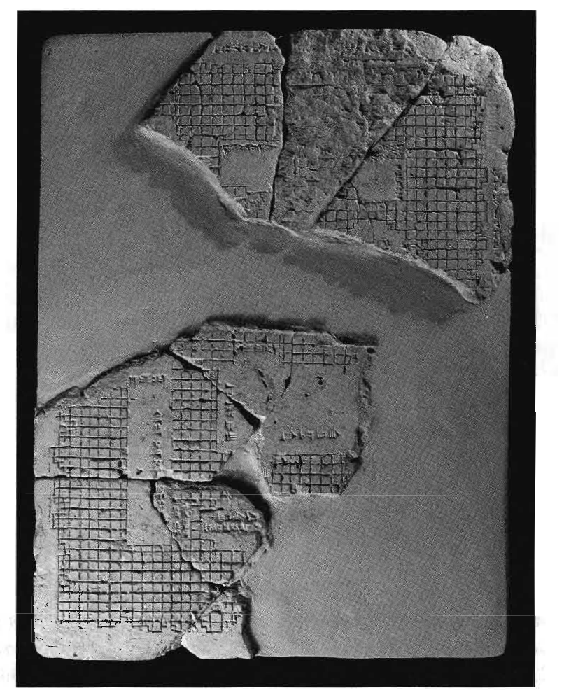

```{r setup, include = FALSE}
options(htmltools.dir.version = FALSE)
library(RefManageR)
BibOptions(check.entries = FALSE, 
           bib.style = "authoryear", 
           cite.style = 'alphabetic', 
           style = "markdown",
           first.inits = FALSE,
           hyperlink = FALSE, 
           dashed = FALSE)
if(dir.exists("pres"))
  f_ref = "pres/rmd/viz-references.bib" else
    f_ref = "viz-references.bib"
my_bib = ReadBib(f_ref, check = FALSE)
```

layout: true
background-image: url(img/r_geocomp_background.png)
background-size: cover

---

# Brief history of geographic vizualisation

- Neo Babylonian (626 BC - 539 BC) temple plan
Source:
`r Citep(my_bib, "talbert_ancient_2014", .opts = list(cite.style = "authoryear"))`

```{r, echo=FALSE, out.width="50%", fig.align = "center"}

```

---

# Brief history of geographic vizualisation

- Neo Babylonian (626 BC - 539 BC) map of the world
Source:
`r Citep(my_bib, "talbert_ancient_2014", .opts = list(cite.style = "authoryear"))`

```{r, echo=FALSE, out.width="50%", fig.align="center"}

```

---

# Brief history of geographic vizualisation

- Humboldt's Naturgemälde (1807, *Geography of Plants*)

```{r, echo=FALSE, out.width="80%", fig.align="center"}
knitr::include_graphics("https://upload.wikimedia.org/wikipedia/commons/thumb/7/7e/Zentralbibliothek_Z%C3%BCrich_-_Ideen_zu_einer_Geographie_der_Pflanzen_nebst_einem_Naturgem%C3%A4lde_der_Tropenl%C3%A4nder_-_000012142.jpg/2560px-Zentralbibliothek_Z%C3%BCrich_-_Ideen_zu_einer_Geographie_der_Pflanzen_nebst_einem_Naturgem%C3%A4lde_der_Tropenl%C3%A4nder_-_000012142.jpg")
```


<!-- - The mappa mundi - largest Mediaval map surviving (~1300 **AD**) -->
<!-- knitr::include_graphics("https://upload.wikimedia.org/wikipedia/commons/4/48/Hereford-Karte.jpg?download") -->

---

# A brief history of geographic data viz in R

"The core R engine was not designed specifically for the display and analysis
of maps, and the limited interactive facilities it offers have drawbacks in this
area" `r Citep(my_bib, "bivand_applied_2013", .opts = list(cite.style = "authoryear"))`.

--

Five years later...

--

"An example showing R's flexibility and evolving geographic capabilities is **leaflet**
`r Citep(my_bib, "R-leaflet", .opts = list(cite.style = "authoryear"))`,
a package for making interactive maps that has been extended by the R community, as we'll see in Chapter 9" 
`r Citep(my_bib, "lovelace_geocomputation_2018a", .opts = list(cite.style = "authoryear"))`.

---

# Base R graphics: sf 

.pull-left[
```{r, message=FALSE, eval=FALSE}
library(spData)
library(sf)
plot(nz[, 1:2])
```
]

.pull-right[
```{r, message=FALSE, echo=FALSE}
library(spData)
library(sf)
plot(nz[, 1:2])
```
]

---

# Base R graphics: sf II

```{r, fig.cap=" ", fig.show='hold', out.width="40%", warning=FALSE}
plot(st_geometry(nz))
plot(nz_height, add = TRUE, cex = nz_height$elevation / 1000)
sf_cols = sf.colors(n = 2, alpha = 0.2)
nz$col = factor(x = nz$Island, labels = sf_cols)
plot(st_geometry(nz), col = as.character(nz$col))
```

---

# sf graphics: code

```{r, eval=FALSE}
# facet plots by default
plot(nz) 
# plot just geometry, ready for new layers:
plot(st_geometry(nz), reset = FALSE)
# addition of new layers
plot(nz_height, add = TRUE)
# create colourscheme, add transparency
sf_cols = sf.colors(n = 2, alpha = 0.2)
nz$col = factor(x = nz$Island, labels = sf_cols)
plot(st_geometry(nz), col = as.character(nz$col))
#  see ?plot.sf for more
```

---

## Observations

- Facets by default: useful for seeing patterns.
- Passes arguments (e.g `cex` for symbol size) to `graphics::plot()`
- Add new layers with `add = ...` argument
- Quick and unrefined, but you can go far with base R graphics 
`r Citep(my_bib, "murrell_graphics_2016", .opts = list(cite.style = "authoryear"))`.

---

# tmap

.pull-left[

- A powerful, dedicated mapping package
.smaller-code-font75[
```{r, eval=FALSE}
library(tmap)
tm_shape(nz) +
  tm_polygons("Median_income", 
              palette = "RdYlBu")
```
]
]


.pull-right[
```{r, echo=FALSE}
library(tmap)
tm_shape(nz) +
  tm_polygons("Median_income",
              palette = "RdYlBu")
```
]


---

# Why tmap?

- It is powerful and flexible.
- Concise syntax, attractive maps with minimal code, familiar to **ggplot2** users.
- Unique capability: same code -> static + interactive maps with switch `tmap_mode()`.
- Wide range of spatial classes (including `raster` objects) supported.
- Well documented + developed --- see [`tmap-nutshell`](https://cran.r-project.org/web/packages/tmap/vignettes/tmap-nutshell.html) and JSS paper
`r Citep(my_bib, "tennekes_tmap_2018", .opts = list(cite.style = "authoryear"))`.


---

# tmap basics

```{r, out.width="32%", fig.show='hold'}
# Add fill layer to nz shape
tm_shape(nz) + tm_fill() 
# Add border layer to nz shape
tm_shape(nz) + tm_borders() 
# Add fill and border layers to nz shape
tm_shape(nz) + tm_fill() + tm_borders() 
```

<!-- --- -->

<!-- # tmap objects -->

<!-- --- -->

<!-- # Aesthetics -->

<!-- --- -->

<!-- # Layouts -->

<!-- --- -->

<!-- # Facets -->

<!-- --- -->

---

# Animations

- Are easy with **tmap** (section [8.3](http://geocompr.robinlovelace.net/adv-map.html#animated-maps) of geocompr)

```{r, echo=FALSE, out.width="80%"}
knitr::include_graphics("https://user-images.githubusercontent.com/1825120/38543030-5794b6f0-3c9b-11e8-9da9-10ec1f3ea726.gif")
```

---

# Interactive maps with mapview

```{r, out.width="60%", out.height="60%", fig.align="center"}
m = mapview::mapview(nz)
m@map
```

---

# Web mapping applications

- Leaflet integrates with **shiny** via `leaflet::leafletOutput()`, enabling web mapping applications built on R
- These can be set-up to scale nationally, as illustrated by [pct.bike](http://www.pct.bike/)
`r Citep(my_bib, "lovelace_propensity_2017", .opts = list(cite.style = "authoryear"))`.


```{r, echo=FALSE, out.width="75%", fig.align="center"}
knitr::include_graphics("https://raw.githubusercontent.com/npct/pct-team/master/figures/pct-frontpage.png")
```

---

# Exercises

Create a map showing the geographic distribution of the Human Development Index (`HDI`) across Africa with:

1. base graphics (hint: use `plot()`) and
2. **tmap** (hint: use `tm_shape(africa) + ...`).
3. Name two advantages of each approach
4. Bonus: name 2 other packages could be used to show the same data?
    
--

## Starting point for the exercise:

```{r, message=FALSE}
library(sf)
library(spData)
library(tidyverse)
africa = world %>% 
  filter(continent == "Africa", !is.na(iso_a2)) %>% 
  left_join(worldbank_df, by = "iso_a2") %>% 
  select(name, subregion, gdpPercap, HDI, pop_growth) %>% 
  st_transform("+proj=aea +lat_1=20 +lat_2=-23 +lat_0=0 +lon_0=25")
```

```{r, echo=FALSE, eval=FALSE}
plot(africa)
library(tmap)
tm_shape(africa) +
  tm_polygons("subregion")
ttm()
tm_shape(africa) +
  tm_polygons("HDI")

tm_shape(spDataLarge::nz_elev) +
  tm_raster() +
  tm_view(basemaps = leaflet::providers$OpenTopoMap)

library(mapde)
```


---

class: small
# References

```{r, 'refs', results="asis", echo=FALSE}
PrintBibliography(my_bib)
```

```{r, echo=FALSE, eval=FALSE}
Questions

# Can you read-in data from R?

# Advice: polygons to intersect raster

# Why are function names in sf called st?

# Can you read-in NetCDF files?

# In the clip is it possible to create a high res raster

#


library(sf)
nz
plot(nz)
plot(nz["Population"])
library(tmap)
tmap_mode("view")
tm_shape(nz) +
  tm_polygons("Population")

elev
tm_shape(elev) +
  tm_raster() +
  tm_view(basemaps = leaflet::providers$OpenTopoMap)

# reprex example
library(rgdal)
library(tmap)
u = "https://github.com/Robinlovelace/geocompr/files/3063017/example_egu.zip"
download.file(u, "example_egu.zip")
unzip("example_egu.zip")
egu_dd <- readOGR(dsn = ".",layer = "example_egu")
colnames(egu_dd@data) <- c("Station","Duration","Corrected Zc","new P-value","N/N*","Original Z","old P.value","Tau","Sen.s.slop", "old.variance","new.variance","Abs.Sen","lat","lon","elevation","region","a_2","n_2","a_5","n_5", "a_10","n_10","a_20","n_20","a_50","n_50","a_100","n_100","a_200","n_200","a_500","n_500", "intensity_2","intensity_5","intensity_10","intensity_20","intensity_50","intensity_100","intensity_200","intensity_500")

# tmap_mode("view")
tm_basemap(leaflet::providers$Esri.WorldImagery,alpha = 0.95)+
tm_shape(egu_dd) +
tm_symbols(col="Sen.s.slop",size = "Abs.Sen",scale = 2,
palette=c("red4","brown1","navy","lightskyblue1"),perceptual = FALSE,border.col = "white",
popup.vars = c("elevation", "Sen.s.slop", "new P-value"))+
tm_layout(title = "Trend on precipitation historical data")+
tm_legend(legend.only=FALSE,legend.show= FALSE,legend.outside=TRUE)+
tm_view(view.legend.position = c("right","bottom"))
```

